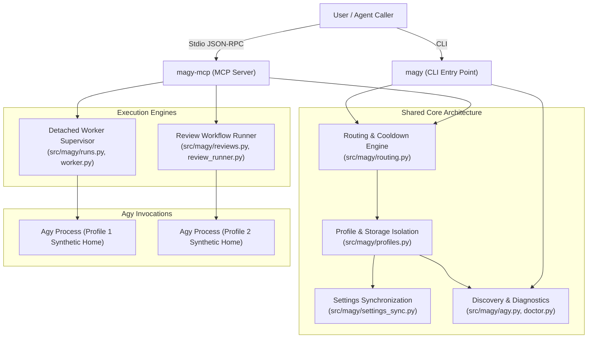
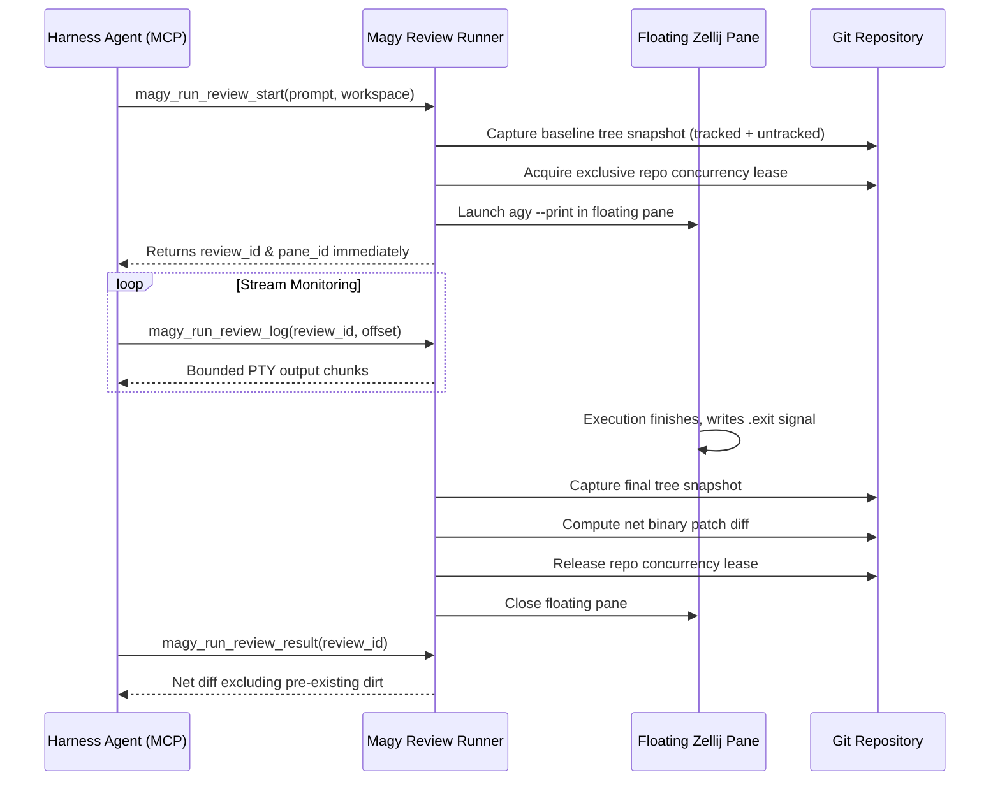

# Magy System Architecture

This document provides an architectural overview of Magy: its component structure, profile isolation mechanism, settings synchronization engine, routing and cooldown semantics, durable worker lifecycle, and human-in-the-loop review workflow.

---

## 1. System Mission & Operating Model

Magy is an orchestrator, supervisor, and Model Context Protocol (MCP) server for the Google Antigravity (`agy`) CLI. It addresses three core requirements:
1. **Multi-Account Rotation**: Running multiple authenticated Agy accounts without token collisions or cross-contamination.
2. **Reliable Routing**: Distributing tasks across healthy profiles with automated cooldown on rate limits or quota exhaustion, backed by a strict no-replay guarantee.
3. **Durable & Supervised Execution**: Managing detached runs and supervised terminal UI sessions across editor restarts and network disconnections.



---

## 2. Directory Layout and Storage Model

Magy uses platform-standard directories via `platformdirs` with owner-only filesystem permissions:

| Platform | Configuration Root (`MAGY_CONFIG_DIR`) | Data Root (`MAGY_DATA_DIR`) | State Root (`MAGY_STATE_DIR`) |
| :--- | :--- | :--- | :--- |
| **Linux** | `~/.config/magy` | `~/.local/share/magy` | `~/.local/state/magy` |
| **macOS** | `~/Library/Application Support/magy` | `~/Library/Application Support/magy` | `~/Library/Caches/magy` |
| **Windows** | `%LOCALAPPDATA%\magy` | `%LOCALAPPDATA%\magy` | `%LOCALAPPDATA%\magy` |

### Security Boundaries
- Directories are created with POSIX mode `0o700` (`rwx------`).
- Files, payloads, and state databases are created with POSIX mode `0o600` (`rw-------`).
- Writes use atomic file replacement (`tempfile.mkstemp` in destination directory followed by `os.replace` and parent directory `fsync`).
- Profile identifiers and run IDs are strictly validated with `validate_identifier()` (`^[a-zA-Z0-9_-]+$`, max length 64) to prevent path traversal.

---

## 3. Profile Isolation Architecture

### 3.1 Synthetic `$HOME` Redirection
Agy persists credentials, SQLite conversation logs, tokens, and runtime state under `$HOME/.gemini/` and `$HOME/.config/antigravity/`.

To enforce isolation without modifying Agy or intercepting OAuth network requests:
- Each profile resides in `<data_dir>/profiles/<name>/`.
- A dedicated synthetic home directory is constructed at `<data_dir>/profiles/<name>/home/`.
- During execution, Magy replaces `HOME` (and on Windows: `USERPROFILE`, `HOMEDRIVE`, `HOMEPATH`) with this synthetic directory.
- Protected isolation variables (`HOME`, `USERPROFILE`, `HOMEDRIVE`, `HOMEPATH`, `MAGY_REAL_HOME`, `AGY_CLI_DISABLE_AUTO_UPDATE`, `MAGY_PROFILE`) are guarded against caller overrides.
- Parent process environment is never modified; changes remain strictly local to child process spawning.

### 3.2 POSIX XDG Variable Derivation
To prevent external shims or runtime tools from falling back to host user locations, Magy derives missing POSIX XDG directories inside the profile home:
- `XDG_CONFIG_HOME = <profile_home>/.config`
- `XDG_DATA_HOME = <profile_home>/.local/share`
- `XDG_CACHE_HOME = <profile_home>/.cache`
- `XDG_STATE_HOME = <profile_home>/.local/state`

---

## 4. Settings Synchronization Engine

To allow profiles to share non-credential configuration (skills, custom rules, keybindings, workflows) without duplicating setup effort, Magy synchronizes configuration from the host `~/.gemini/` into each profile.

### 4.1 Strict Allowlist
Only explicitly safe configuration items are synchronized:
- Top-level files: `GEMINI.md`, `antigravity.json`, `tools.json`, `mcp_config.json`, `extensions.json`, `keybindings.json`, `settings.json`.
- Directories: `rules/`, `skills/`, `extensions/`, `workflows/`.
- All credential files (`credentials.json`, `auth.json`, token caches) are strictly excluded.

### 4.2 Symlink Traversal and TOCTOU Defense
- Any source symlink pointing outside the source directory is rejected.
- Destination paths are inspected: if any component is a symlink, synchronization aborts immediately.
- Inode and file descriptor checks verify paths before and after copy operations to defeat time-of-check-to-time-of-use (TOCTOU) symlink substitution attacks.

---

## 5. Executable Discovery & Doctor Diagnostics

Magy resolves the target `agy` binary with strict indirection classification in `src/magy/agy.py`:
1. Candidate enumeration inspects `MAGY_AGY_CMD`, configured `agy_cmd`, and directories on `PATH`.
2. Candidates retain their lexical invocation path (`argv[0]`) so multicall tools (e.g., `mise`) retain dispatch identity during evaluation.
3. Multicall shims and indirect wrappers are classified without executing external code. If an indirect candidate is encountered on `PATH`, Magy skips it and continues searching for a direct executable.
4. Users of tool managers can configure `agy_resolver` (e.g., `["mise", "which", "agy"]`). The resolver is executed dynamically on every launch and doctor probe, ensuring tool upgrades take effect immediately without caching stale paths.
5. `magy doctor` reports environment diagnostics, executable paths, and version compatibility without reading or printing credential contents.

---

## 6. Routing, Health, & No-Replay Semantics

### 6.1 Atomic Round-Robin Routing
Magy maintains a locked routing cursor across concurrent processes using file locks (`filelock`). Only enabled, healthy profiles not currently in cooldown are eligible for automatic selection.

### 6.2 Health & Cooldown Classification
- **Rate-limit / Quota Exhaustion**: Profile enters cooldown (default: 60s). Magy advances to the next available healthy profile for subsequent runs.
- **Authentication Failure**: Profile is marked `unhealthy` and removed from rotation until explicitly re-authenticated via `magy profile auth <name>`.
- **Health Recovery**: Successful runs reset cooldown state and mark the profile `healthy`.

### 6.3 No-Replay Guarantee
If a run fails in-flight due to quota limits, rate limits, or network errors, Magy **never** silently replays the prompt on another profile. Replaying tasks could trigger duplicate side effects (e.g., duplicate git commits, duplicate ticket creation, file overwrites). Instead, Magy fails fast and provides an actionable error indicating alternative healthy profiles.

---

## 7. Durable Background Worker Lifecycle

The MCP server and background task subsystem use detached workers (`src/magy/runs.py`, `src/magy/worker.py`):
1. **Detached Worker Process**: Tasks are spawned with `subprocess.Popen` in a new process group (`start_new_session=True`). The worker runs independently of MCP client connection status.
2. **Anti-PID-Recycling Safeguards**: Workers write an ephemeral UUID marker file (`/tmp/magy-worker-<pid>.marker`). Before sending cancellation signals (`SIGTERM`/`SIGKILL`), Magy validates the marker file's existence, owner, and expected run UUID.
3. **Process Group Reaping**: Cancellation reaps the entire descendant process tree via PGID signaling and `/proc` inspection.
4. **Stable Pagination**: Standard output and error logs are stored on disk and read in bounded chunks with stable byte offsets via `magy_run_result`.

---

## 8. Human-in-the-Loop Review Architecture

For interactive or supervised workflows, Magy provides a Zellij-backed review runner (`src/magy/reviews.py`, `src/magy/review_runner.py`):



### Key Design Pillars:
1. **Non-Interactive Floating Pane**: Runs `agy --print <prompt>` in a floating Zellij pane. The user observes thinking and tool execution in real-time, but the process terminates cleanly on completion.
2. **Git Baseline Dirt Exclusion**: Creates a temporary Git tree index of tracked, staged, and untracked files before launch. The final diff computed on completion excludes all pre-existing modifications:
   ```bash
   git diff --no-ext-diff --no-textconv --binary <baseline-tree> <final-tree>
   ```
3. **Repository Concurrency Lease**: Exclusive lease per repository root prevents interleaved modifications from concurrent review runs.
4. **Conversation Continuation & Profile Pinning**: Supplying `continue_review_id` pins the execution to the exact profile used previously and passes `--continue`, seamlessly preserving conversation SQLite context.

---

## 9. Related Documentation

- [Security Architecture & Threat Model](security.md)
- [Compatibility Architecture](compatibility.md)
- [MCP Server Setup & Tools](../guides/mcp-configuration.md)
- [Windows Verification & Testing](../guides/windows-testing.md)
- [v1 Milestone Roadmap](../plans/v1/README.md)
